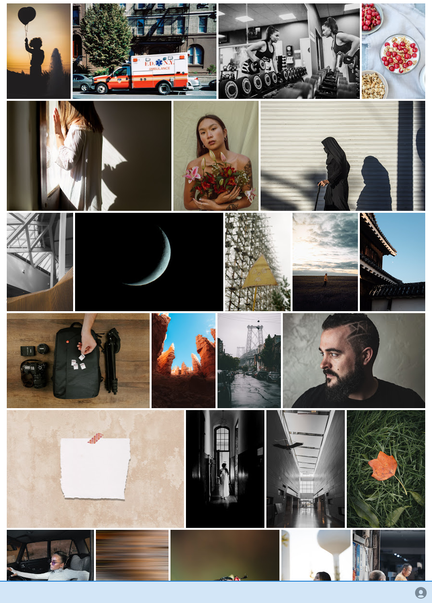
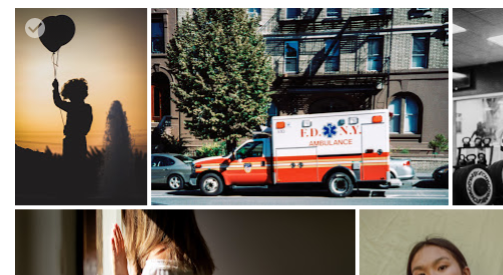
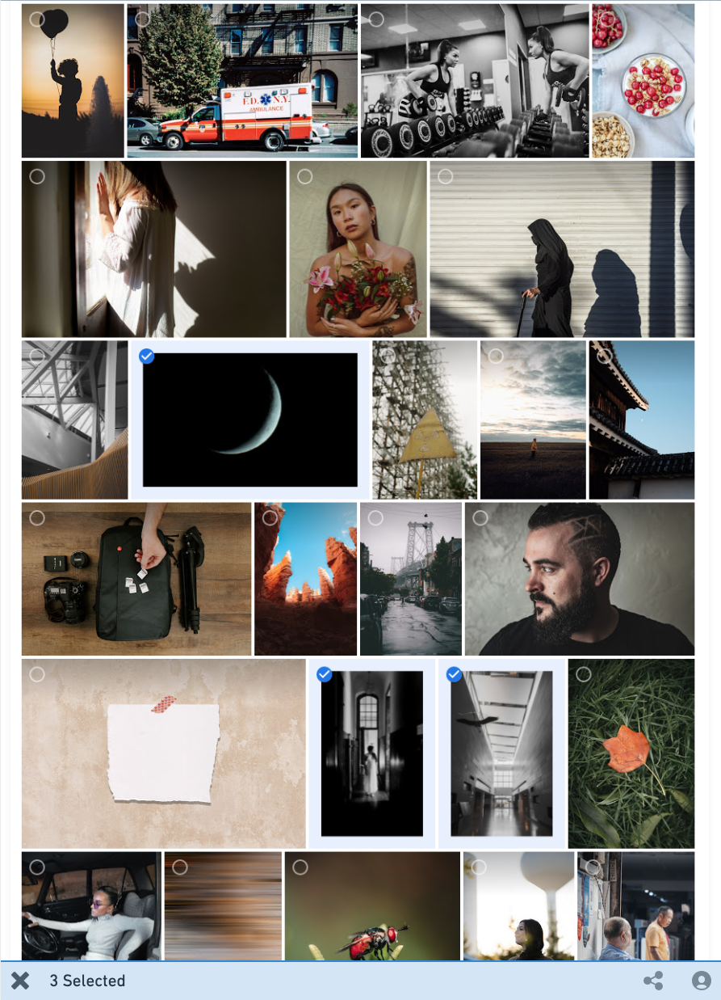
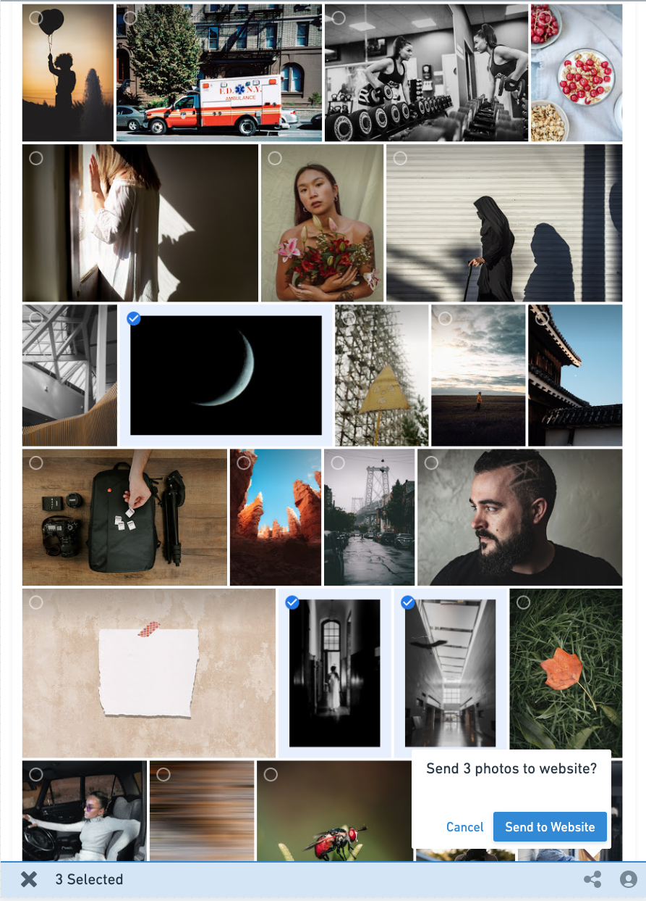
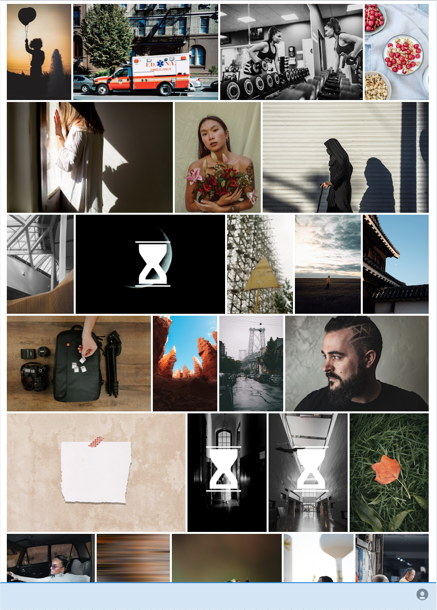

# Mini CrowdRiff Platform Challenge

## Overview

This repository contains two components:

- a server located in the `/server` directory
- a React client built with `create-react-app` located in the `/src` directory

## Prerequisites

- Node >= v12

## Getting Started

1. Clone this repo
2. Run `npm install`
3. Run `npm start` to start the server and client

The server runs on port 3001 and supports CORS requests.
The create-react-app dev server runs on port 3000.

## Objective

The objective of this challenge is to build a Google Photos style app that mimics some functionality of the CrowdRiff product using React and Redux. The challenge is chunked up into three milestones. The focus is more on getting the functionality working rather than matching the design exactly as shown in the mockups below, as long as the final product looks somewhat like what's shown in the mockups. Feel free to add any additional dependencies and include them in the `package.json`. For your submission, 

1. Create a branch off the `main` branch.
2. Push your submission to the feature branch.
3. Create a pull request from your feature branch to `main`. 

It is ok to have as many commits as you want in the feature branch as long as we end up with one pull request to merge changes from the feature branch to `main`.

### Milestone 1 - Load a list of photos

The first milestone is the creation of the landing state of the app. The landing state is shown in the following mock:  

* When the user loads the app, it should reach out to the API and load a list of photos and display them in a grid.

* Use the `http://localhost:3001/photos` endpoint to get a list of photos to display.

* There is a sticky nav bar at the bottom that shows a user avatar icon in the far right. You should be able to scroll the grid of photos as the bottom nav remains in view at all times. The avatar icon offers no interactivity.

* Don't worry too much about making it look exactly like the mock. It's ok to take some liberties with the design as long as the spirit of the milestone is achieved. 

### Milestone 2 - Multi-select photos

The second milestone involves adding some interactivity to the photos in the grid.

* When you hover over a photo, it should show a checkmark or some way of invoking the multi-select action.

* Once a photo is selected, it should show a "selected" state.

* Once at least one photo has been selected, the sticky nav at the bottom should display the number of photos that have been selected and offer a way to clear the selection.

* Once at least one photo has been selected, one additional "share" icon appears near the avatar icon in the sticky nav (as per the mock). We don't have to add any interactivity to this icon right now; it will be used in Milestone 3. When the selection is cleared, this additional icon disappears as well.

### Milestone 3 - Add photos to website

The third milestone involves being able to action a set of selected photos and send them directly to your Website/CMS from our app.

* For the purpose of this exercise, sending a photo to our CMS can be done by making a `POST` call to the `http://localhost:3001/website/photos/{photo-id}`.

* The sending of photos is a process that needs approval from the person managing the website. Once you make the API call to send a photo to the website, it returns with the status `PENDING_APPROVAL` for each photo. There's a WebSocket connection that you can connect to at `http://localhost:3001/ws` which will fire messages over the socket when the photo has been approved for use on the website. Our dummy server is setup to simulate this workflow by waiting for a few seconds after the API call has been received to send out the approval messages over the websocket.

* We want to offer the ability to send the entire selection of photos to the website by clicking the "share" button in the nav bar. Once this button has been clicked, a confirmation box pops up.

* Once the user confirms their selection, you can make the API call to send those photos to the website and show them as "PENDING" in the grid in some way (the mockup shows a giant hourglass in the middle of the photo, you don't need to follow this exact design). Once all the photos have been sent to the website, the selection is cleared automatically.

* Once you receive the approval messages over the websocket, you can mark the photos on the grid as "sent to website" by removing the giant hourglass and adding a small share icon in the bottom right of the photo.

## QA Script

Here's a list of questions we ask when evaluating challenge functionality:

* Can we still run the app with the instructions provided in the initial README?
* Does the app load without any errors in the console?
* Is the UI responsive?
* Are we able to select photos by hovering over them?
* Does the selected photo count and “send to website” button appear in the sticky nav appear when photos are selected?
* Are we able to clear the selection?
* Does the selected photo count and “send to website” button disappear from the sticky nav when the selection is cleared?
* Can we select photos and invoke the send to website flow?
	* Does the loading state appear when we invoke this flow?
	* Are the photos marked as “sent to website” once the flow has completed? Does the loading state disappear?# photos-app
# photos-app
# photos-app
# photos-app
